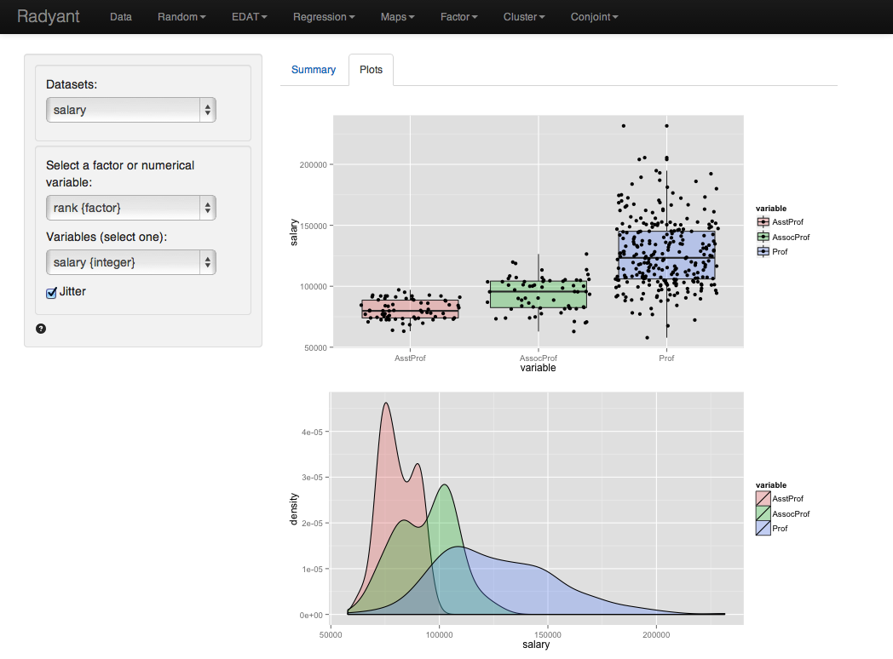

The compare means t-test is used to compare the mean of a variable for one sample in our data to the mean of the same variable in one, or more, other samples. This is important since we seldom have access to data for an entire population. The hypothesized value in the population is specified in the 'Comparsion value' box. 

We can perform either a one-tailed test (i.e., less than or greater than) or two-tailed test (see 'Alternative hypothesis'). In marketing we often use one-tailed tests because we want to evaluate if the available data provide evidence that a variable or effect is larger (or smaller) in one sample than another.

#### Example: Professor salaries

We have access to the 2008-09 nine-month academic salary for Assistant Professors, Associate Professors and Professors in a college in the U.S. The data were collected as part of the on-going effort of the college's administration to monitor salary differences between male and female faculty members. A data frame with 397 observations on the following 6 variables.

- rank = a factor with levels AsstProf, AssocProf, and Prof
- discipline = a factor with levels A (“theoretical” departments) or B (“applied” departments)
- yrs.since.phd = years since PhD
- yrs.service = years of service
- sex = a factor with levels Female and Male
- salary = nine-month salary, in dollars

The data are part of the CAR package for R and are linked to the book:  Fox J. and Weisberg, S. (2011) An R Companion to Applied Regression, Second Edition Sage.

We first select professor 'rank' and select 'salary' as the numerical variable to compare across ranks. Radiant will do a pair-wise comparison of salaries across the three levels. We are interested in a one-sided hypothesis. Specifically, we will invesigate, as we might expect, professors of higher rank earn a higher income compared to those of lower rank.

Because the p-values are smaller than the conventional level of significance (i.e. 0.05) for each pair-wise comparison we can reject the null hypothesis based on the available sample. 

In addition to the numerical output provided in the Summary tab we can also evaluate the hypothesis visually (see Plots tab). The settings in the side-panel are the same as before. The tab displays a set of box-plots and density-plots of the professor salaries. Consistent with the results shown in the Summary tab there is clear separation between the salaries across ranks. 

&copy; Vincent Nijs (2014) 
