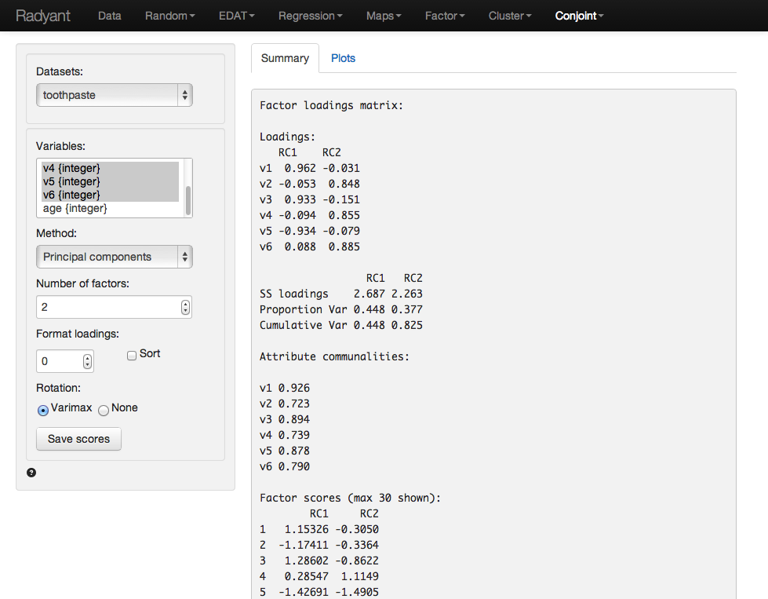
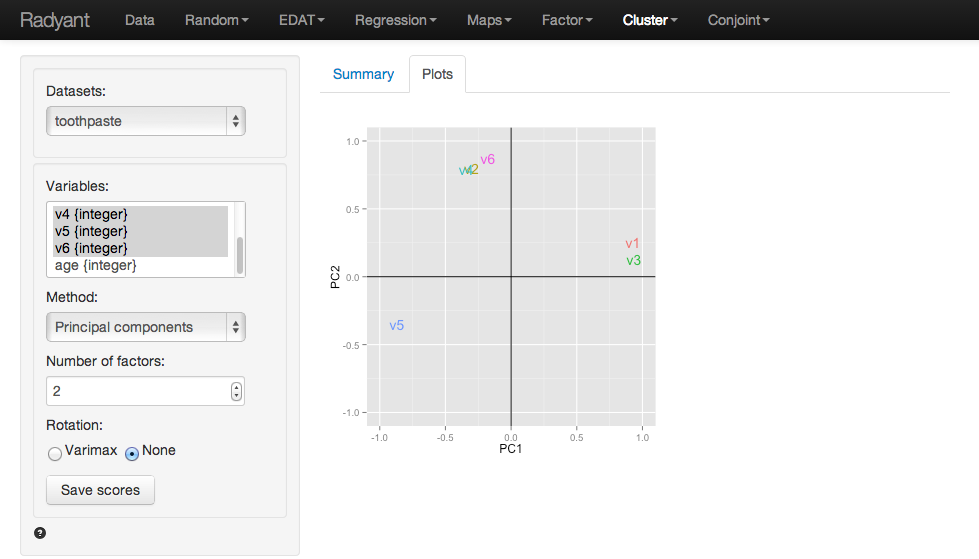
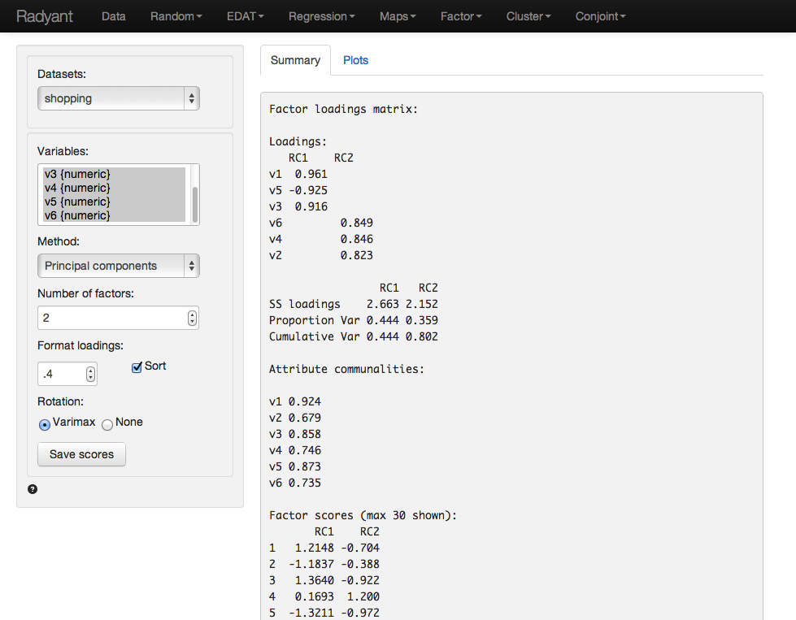

As stated in the documentation for pre-factor analysis, the goal is to reduce the dimensionality of the data without significant loss of information. The tool tries to achieve this goal by looking for structure in the correlation matrix of the variables included in the analysis. The researcher will usually try to link each of the original variables to an underlying factor and then provide a descriptive label for each factor (i.e., a name).

# Example: Toothpaste

Click the 'examples' radio button on the Data > Manage page and click 'Load examples' then choose the toothpaste  data from the Datasets dropdown. The data set contains information from 60 consumers who were asked to respond to six questions to determine their attitudes towards toothpaste. The scores shown for variables v1-v6 indicate the level of agreement with the statement indicated on a 7-point scale where 1 = strongly disagree and 7 = strongly agree.

Once we have determined the number of factors we can extract and rotate them. The factors are rotated to generate a solution where, to the extent possible, a variable has a high loading on only one factor. This is an important benefit because it makes it easier to interpret what the factor represents. While there are numerous algorithms to rotate a factor loadings matrix the most commonly used is Varimax rotation.

The numbers in the table are the correlations of the six variables with the two Factors. For example, variable v1 has a correlation of .962 with Factor 1 and a correlation of -.031 with Factor 2. As such v1 will play a big role in naming Factor 1 but an insignificant role in naming Factor 2. 

The rotated factor loadings will be used to determine labels or names for the different factors. We need to identify and highlight the highest factor loading, in absolute value, in each row. This is most easily done by setting number in the Format loadings input to .4 and checking the Sort box. Together, the variables highlighted in each column (i.e., for each factor) will help us to understand what the factor represents. Questions 1, 3 and 5 reflect the importance of health issues while questions 2, 4, and 6 reflect aesthetics issues. Plausible names for the factors might therefor be:

Factor 1: Health benefits
Factor 2: Social benefits

The best way to see what rotation does is to toggle the radio buttons for Varimax and inspect what changes in the output. To start click on the Plots tab and set the radio button to None. The image shown below depicts the loadings of the variables on the two factors. Variable 5 falls somewhat in between the lines for factor 1 and factor 2. When we select Varimax rotation, however, the label for v5 lines up nicely with the horizontal axis. This change in alignment is also reflected in the factor loadings. The unrotated factor loadings for v5 are -0.869 for factor 1 and -0.351 for factor 2. The rotated factor loadings for v5 are -0.934 for factor 1 and -0.079 for factor 2.

The final step is to generate the factor scores. You can think of these scores as a weighted average of the variables that are linked to a factor. They approximate the scores that a respondent would have provided if we could have asked about the factor in a single question, i.e., the respondents inferred ratings on the factors. By clicking on the 'Save scores' button two new variables will be added to the toothpaste data file. You can see them by going to Data > View. We can use factor scores in other analyses (e.g., cluster analysis or regression). You can rename the new variables, e.g., to 'health' and 'social' through Data > Transform by selecting 'Rename' from the Transformation type dropdown.

#### Summary

1. Determine if the data are appropriate for factor analysis using Bartlett, KMO, and Collinearity (see pre-factor analysis)
2. Determine the number of factors (see the scree-plot and eigenvalues > 1 produced through pre-factor analysis)
3. Extract the (rotated) factor solution to produce: 
	- Factor loadings: Correlations between attributes and factors
	- Factor scores: Inferred ratings on the new factors
5. Identify the highest factor loading, in absolute value, in each row (i.e., for each variable)
4. Interpret the factors using the strongest factor loadings and label them

If you want more practice open the 'shopping' data set and see if you can reproduce the results shown in the screen capture of the Summary tab below. Using pre-factor analysis determine if the the correct number of factors were selected. Why (not)?

&copy; Vincent Nijs (2014) 