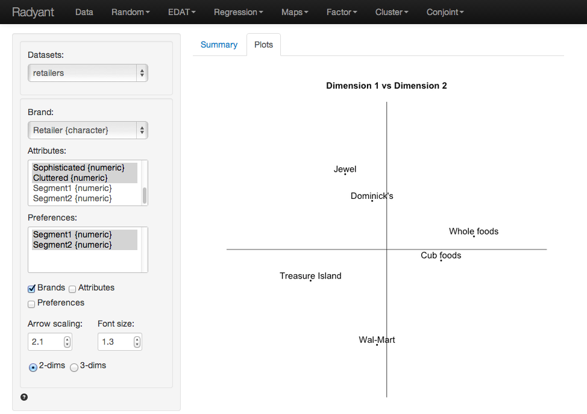

Brand maps based on attribute data can be analyzed using Factor analysis. These maps give a rich summary of the original data.

#### Example

Click the 'examples' radio button on the Data > Manage page and click 'Load examples' then choose the retailers data from the Datasets dropdown. The data set contains information on consumer evaluations for a set of retailers in the Chicago area on 7 attributes. In addition to attribute evaluations the dataset contains preference ratings on a scale from 1-9 for each retailer for two predefined consumer segments.

Select the Retailer variable as the Brand attribute. This is simply a list of retailer names/labels. Then select the variables Good.value through Cluttered in the Attributes box. Choose the Segment 1 and Segment 2 variables in the Preferences box. The variables in the Attributes box will be analyzed using factor analysis and the output is provided in the Summary tab. We will start with a 2-dimensional solution.

The first table shows the factor scores for the brands. In essence these are a weighted average of the original attribute data, where the weights are the factor loadings. In other words, the factor scores are (two) variables created by factor analysis to summarize the information contained in the original 7 attributes. The second table of numbers shows the factors loadings. These represent the correlations between the original attribute variables and the created factor scores. 

We are also provided with information on how much of information content of the attribute variables is captured in the two derived factors. The first factor captures 56.4% and factor two captures 42% of the variation in the original data. Together the factors cover 98.4% of the variation, i.e., the information loss from reducing the dimensionality of the data from 7 attributes to two factors is only 1.6%. Adding a third factor will only increase the captured variance slightly but will make the interpretation of the map(s) more difficult. Therefore we will focus on the 2-dimension brand map.  

The preference correlations indicate how strongly the preference scores provided by the respondents are linked to the uncovered factor scores. The preferences for Segment 2 seems very strongly positively correlated with factor two so we might expect to see the preference arrow for this segment pointing almost straight up. The communalities indicate how much of the variation in the segment preferences can be explained by the two factors. The number are excellent (i.e., 97.5% for segment 1 and 91.5% for segment 2). We can infer from these numbers that the attributes selected in the study reflect consumers preferences very well, a key feature of useful brand mapping research. Choosing attributes that are not linked to customer preferences ensures the brand map will be of limited value to a manager.

The final table shows the attribute communalities. These numbers indicate how much of the variation in the attributes data can be explained by the two factors. The cumulative variance mentioned earlier is an overall measure across attributes. However, we are also interested to see if each of the individual attributes is well represented by the factor scores. The numbers in this example are excellent across the board (i.e., all over 90%).

It is useful to start with a map in the Plots tab with only the brands shown. Create the map by checking the ‘Brands’ box. The graph is a scatter plot of the scores for factor 1 (the horizontal axis) and factor 2 (the vertical axis). In other words the scores for a brand on factor 1 and factor 2 are the coordinates for that brand in the map. The retailer names are used to label each point.

We can create a brand map with both the brand locations (again, using the factor scores) and the attribute arrows (using the factor loadings) by checking both the 'Brands' and 'Attributes' boxes. The orientation of the arrows is determined by the level of correlation of an attribute with factor 1 and factor 2, i.e., the factor loadings. The attribute Service has a strong positive loading on factor 1 and so it points, mostly, in the direction in which factor 1 increases in value (i.e., to the right). Since it's correlation with factor 2 is, slightly, positive the arrow points up rather than down. In contrast, the attribute Convenience has a strong positive loading on factor 2 and so it points, mostly, in the direction in which factor 2 increases in value (i.e., up). Since it's correlation with factor 1 is, slightly, positive the arrow points to the right rather than to the left. The length of the arrows is directly linked to the communalities reported in the Summary tab. The higher the communality, the longer the arrow. If an attribute is not well summarized in the derived factors it's communality would be low and the arrow in the brand map for that attribute would be short.

Finally, we can add the preference information to the map by checking the 'Preferences' box. The orientation of the segment preference arrows is determined by the correlation between the factor scores and the preference scores. Since the preferences for the retailers expressed by respondents assigned to segment 2 are highly correlated with factor 2 the arrow points almost straight up. The negative correlations of the preference scores for segment 1 with both factor 1 and factor 2 ensure the arrow will point down and to the left. 

In the plot we see that Whole foods and Cub foods are perceived as more comparable on the attributes for which we have data than, for example, Whole foods and Wal-Mart. From the plot a manager might conclude that the brands that are closest together in the map are perceived as close substitutes and, hence, close competitors in the minds of consumers. 

An important limitation of a map without attribute information, e.g., based on (dis)similarity data, is that it is difficult to interpret why brands are located close together or far apart. By adding the attribute arrows to the map as shown above our understanding of the brand positions in the maps is strongly enhanced. For example, Jewel and Dominick's are positioned higher in the map because they are perceived to offer consumers higher levels of convenience. Similarly, Cub foods, and particularly Whole foods offer higher levels of customer service and quality products. We can also infer the the attributes are are most strongly linked to consumer preferences. Segment 2 if primarily concerned with Convenience which is also why they have higher preference scores for Jewel and Dominick's. Similarly Segment 2 cares most for Good value and very little for Assortment. This segment prefers to shop at Treasure Island and Wal-Mart.

&copy; Vincent Nijs (2014) 