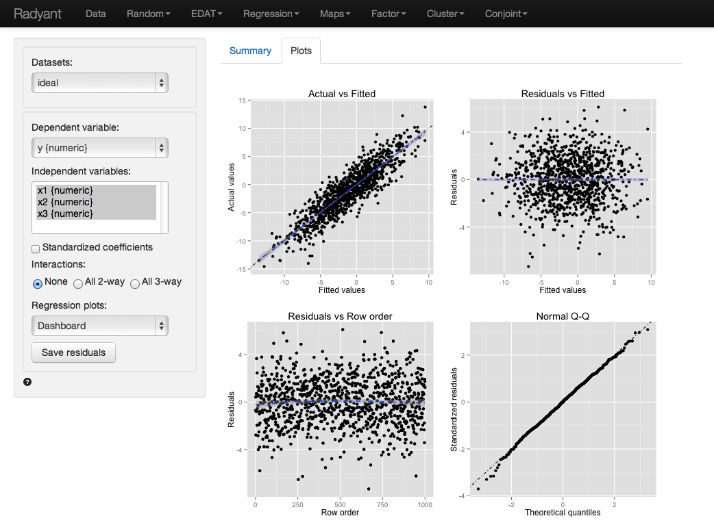
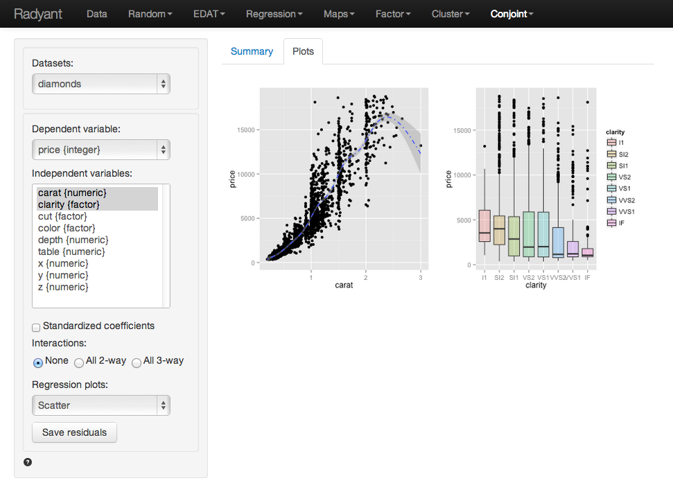
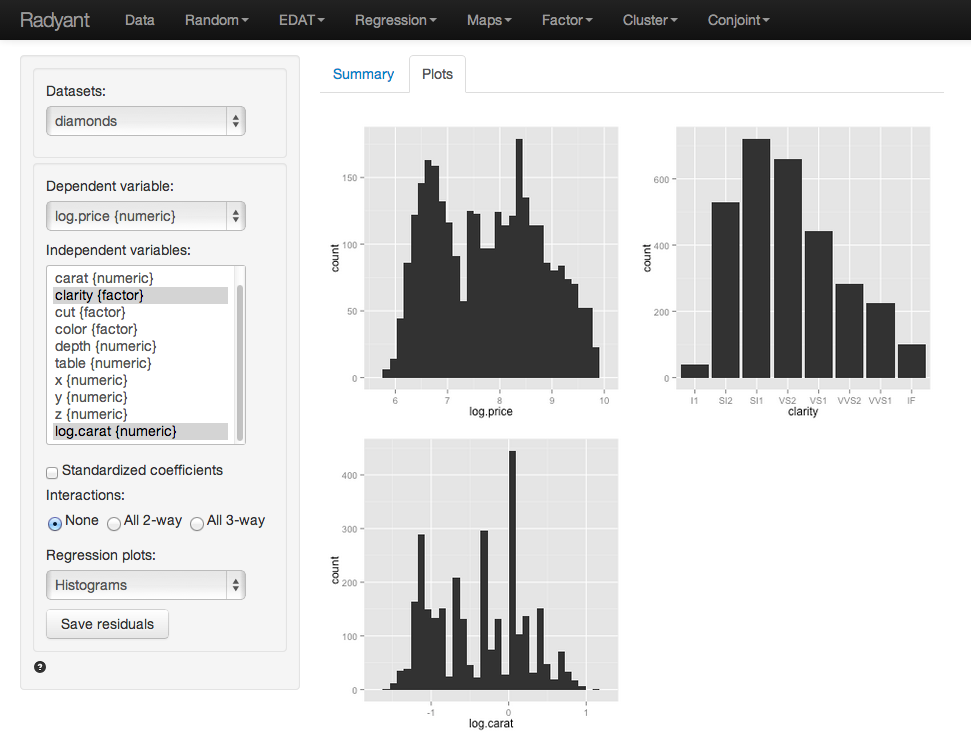
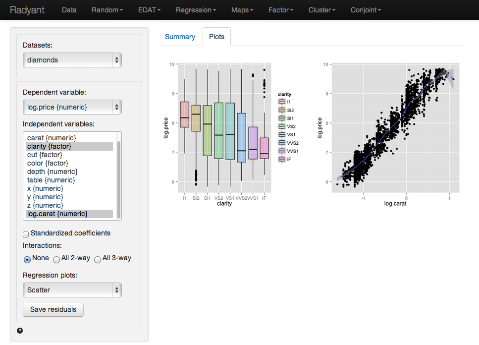
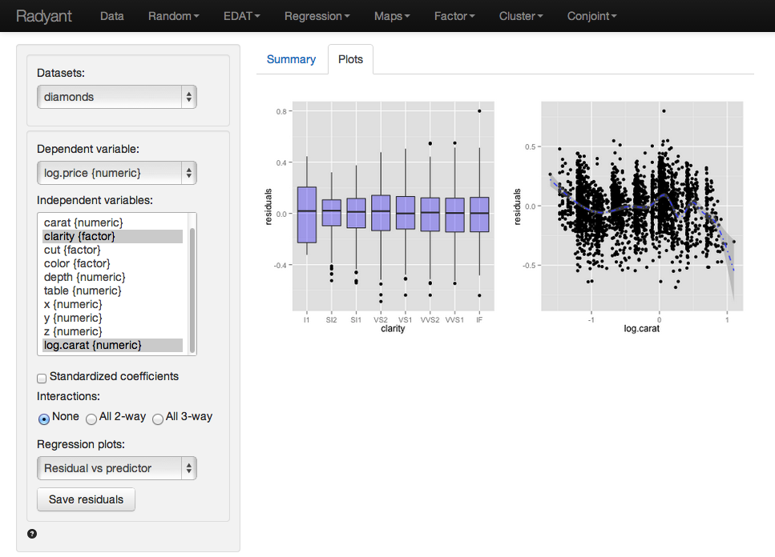

All example files can be loaded from Data > Manage. Click the 'examples' radio button and press 'Load examples'.

#### Example 1:  Catalog sales

We have access to data from a company selling men’s and women’s apparel through mail-order catalogs (dataset 'catalog'). The company maintains a database on past and current customers’ value and characteristics. Value is determine as the total$ sales to the customer in the last year. The data are a random sample of 200 customers from the company’s database. The r-data contains a data frame with 200 observations on 4 variables

- Sales =  Total sales (in $) to a household in the past year
- Income = Household income ($1000) 
- HH.size = Size of the household (# of people) 
- Age = Age of the head of the household

The catalog company is interested in redesigning their Customer Relationship Management (CRM) strategies. We will proceed in two steps: 

1. Estimate a regression model using last year’s sales total. Dependent variable: sales total for each of the 200 households; explanatory variables: household income (measured in thousands of dollars), size of household, and age of the household head. The data-set is given in the ‘catalog’ data file. Interpret each of your estimated coefficients. Also provide a statistical evaluation of the model as a whole.
 
2. Which explanatory variables are significant predictors of customer value (use a 95% confidence level)? 

Answer:

Output from Radiant (Regression > Linear (OLS)) is provided below:

The F-statistic suggests that the regression model as a whole explains a significant amount of variance in Sales. The calculated F-value is equal to 32.33 and has a very small p-value (< 0.001). The amount of variance in sales explained by the model is equal to 33.1%

The null and alternate hypothesis for the F-test test can be formulated as follows:
H0: All regression coefficients are equal to 0
Ha: At least one regression coefficient is not equal to zero

The coefficients from the regression can be interpreted as follows:

For an increase in income of $1000 we expect, on average, to see an increase in sales of $1.7754, keeping all other factors constant.
- For an increase in household size of 1 person we expect, on average, to see an increase in sales of $22.1218, keeping all other factors constant.
- For an increase in the age of the head of the household of 1 year we expect, on average, to see an increase in sales of $0.45, keeping all other factors constant.

For each of the independent variables the following null and alternate hypotheses can be formulated:
H0: The coefficient associated with independent variable X is equal to 0
Ha: The coefficient associated with independent variable X is not equal to 0

The coefficients for 'Income' and ’HH.size' are both significant (p-values < 0.05), i.e., we can reject H0 for each of these coefficients. The coefficient for Age HH is not significant (p-value > 0.05), i.e., we cannot reject H0 for Age HH. We conclude that a change in Age of the household head does not lead to a significant change in sales.

#### Example 2: Ideal data for regression 

The data 'ideal' contains simulated data that is very useful to demonstrate what data for and residuals from a regression should ideally look like.  The r-data file contains a data-frame with 1000 observations on 4 variables. y is the dependent variable and x1, x2, and x3 are independent variables. The plots shown below can be used as a bench mark for regressions on real world data. We will use Regression > Linear (OLS) to conduct the analysis. First go the the Plots tab and select y as the dependent variable and x1, x2, and x3 as the independent variables.

y, x2, and x3 appear roughly normally distributed whereas x1 appears roughly uniformly distributed. No indication of outliers or severely skewed distributions.

In the plot of correlations there are clear associations among the dependent and independent variables as well as among the independent variables themselves. Recall that in an experiment the x's of interest would have a zero correlation. The scatter plots in the lower-diagonal part of the plot show that the relationships between the variables are (approximately) linear.

The scatter plots of y (the dependent variable) against each of the independent variables confirm the insight from the correlation plot. The line fitted through the scatter plots is sufficiently flexible that it would pickup any non-linearities. The lines are, however, very straight suggesting that a basic linear will likely be appropriate.

The dashboard of four residual plots looks excellent, as we might expect here. True values and predicted values from the regression form a straight line with random scatter. The residuals (i.e., the differences between the actual data and the values predicted by the regression) show no pattern and are randomly scattered around a horizontal axis. If a pattern were visible in the Residual vs Row order plot we might be concerned about auto-correlation. Again, the residuals are nicely scattered about a horizontal axis. Finally, the Q-Q plot shows a nice straight and diagonal line, evidence that the residuals are normally distributed.

The final diagnostic we will discuss is a set of plots of the residuals versus the independent variables (or predictors). There is no indication of any trends or heteroscedasticity. Any patterns in these plots would be cause for concern. There are also no outliers, i.e., points that are far from the main cloud of data points.

Since the diagnostics look good, we can draw inferences from the regression. First, the model is significant as a whole: the p-value on the F-statistic is less than 0.05 therefore we reject the null hypothesis that all three variables in the regression have slope equal to zero. Second, each variable is statistically significant: for example, the p-value on the t-statistic for x1 is less than 0.05 therefore we reject the null hypothesis that x1 has slope equal to zero when x2 and x3 are also in the model (i.e., 'holding all other variables constant').

Increases in x1 and x3 are associated with increases in y whereas increases in x2 are associated with decreases in y. Since these are simulated data the scale of the variables is not relevant. In the scatterplot, it looked like increases in x3 were associated with decreases in y. What explains the difference (hint: consider the correlation plots)?

#### Example 3: Linear or log-log regression?

In marketing both linear and log-log regressions are very common. In this example we will look for evidence in the data and residuals that may which model specification is more appropriate for the available data.

The data 'diamonds' contains information on prices of 3000 diamonds. A more complete description of the data and variables is available from the Data > Manage page. Select the variable 'price' as the dependent variable and 'carat' and 'clarity' as the independent variables. Before looking at the parameter estimates from the regression go to the Plots tab to take a look at the data and residuals. Below are the set of histograms for the variables in the model. Prices and carats seems skewed to the left. 

In the plot of correlations there are clear associations among the dependent and independent variables. The correlation between price and carat is extremely large (i.e., .93). The correlation between carat and clarity of the diamond is significant and negative.

The scatter plots of price (the dependent variable) against the independent variables are not as clean as for the 'ideal' data in example 2. The line fitted through the scatter plots is sufficiently flexible to pickup non-linearities. The line for carat seems to have some curvature and the points do not look randomly scattered around that line. In fact the points seem to fan-out for higher prices and number of carats. There does not seem to be very much movement in price for different levels of clarity. If anything, the price of the diamond seems to go down as clarity increase. A surprising result we will discuss in more detail below.

The dashboard of four residual plots looks less than stellar. The true values and predicted values from the regression form an S-shaped curve. At higher actual and predicted values the spread of points around the line is wider, consistent with what we saw in the scatter plot of price versus carats. The residuals (i.e., the differences between the actual data and the values predicted by the regression) show an even more distinct pattern as the residuals are clearly not randomly scattered around a horizontal axis. The Residual vs Row order plot looks perfectly straight indicating that auto-correlation is not a concern. Finally, while for the 'ideal' data in example 2 the Q-Q plot showed a nice straight and diagonal line, here the dots separate from the line at the right extreme, evidence that the residuals are not normally distributed.

The final diagnostic we will discuss is a set of plots of the residuals versus the independent variables (or predictors). The residuals fan-out from left to right in the plot of residuals vs carats. The box-plot of clarity versus residuals shows outliers with strong negative values for lower levels of clarity and outliers with strong positive values for diamonds with higher levels of clarity. 

Since the diagnostics do not look good, we should not draw inferences from this regression. A log-log specification may be preferable.

We will apply a log transformation to both price and carat and rerun the analysis to see if the log-log specification is more appropriate for the data. This transformation can be done in Data > Transform. Select the variables price and carat. Choose 'change' from the Transformation type drop-down and choose 'Log' from the Apply function drop-down. Make sure to 'Save changes' so the new variables are available in the data. Note that we cannot apply a log transformation to clarity because it is a <a href="http://en.wikipedia.org/wiki/Categorical_variable" target="_blank">categorical</a> variable.   

In Regression > Linear (OLS) select the variable 'log.price' as the dependent variable and 'log.carat' and 'clarity' as the independent variables. Before looking at the parameter estimates from the regression go to the Plots tab to take a look at the data and residuals. Below are the set of histograms for the variables in the model. log.price and log.carat are not longer left skewed, a good sign. 

In the plot of correlations there are still clear associations among the dependent and independent variables. The correlation between log.price and log.carat is extremely large (i.e., .93). The correlation between log.carat and clarity of the diamond is significant and negative.

The scatter plots of price (the dependent variable) against the independent variables are now much cleaner. The line through the scatter plot of log.price versus log.carat for carat is (mostly) straight. Although the points do have a bit of a blocked shape around the line the scattering seem mostly random. We no longer see the points fan-out for higher log.prices and log.carats. There seems to be a bit more movement in log.price for different levels of clarity. However, the log.price of the diamond still goes down as clarity increase. We will discuss this result below.

The dashboard of four residual plots looks much better than for the linear model. The true values and predicted values from the regression (almost) form straight line. At higher and lower actual and predicted values the line is still slightly curved. The residuals (i.e., the differences between the actual data and the values predicted by the regression) are much closer to a random scatter around a horizontal axis. The Residual vs Row order plot still looks perfectly straight indicating that auto-correlation is not a concern. Finally, the Q-Q plot shows a nice straight and diagonal line, just like we saw for the 'ideal' data in example 2, Evidence that the residuals are not normally distributed.

The final diagnostic we will discuss is a set of plots of the residuals versus the independent variables (or predictors). The residuals look much closer to random scatter around a horizontal line compares to the linear model, although for low (high) values of log.carat the residuals may be a bit higher (lower). The box-plot of clarity versus residuals now only shows a few outliers.

Since the diagnostics now look much better, we can feel more confident about drawing inferences from this regression. The regression results are available in the Summary tab. Rh 

The F-statistic suggests that the regression model as a whole explains a significant amount of variance in log.price. The calculated F-value is very large and has a very small p-value (< 0.001) so we can reject the null hypothesis that all regression coefficients are equal to zero. The amount of variance in log.price explained by the model is equal to 96.6. It seems likely that prices of diamonds are much easier to predict then demand for diamonds.

The null and alternate hypothesis for the F-test test can be formulated as follows:
H0: All regression coefficients are equal to 0
Ha: At least one regression coefficient is not equal to zero

The coefficients from the regression can be interpreted as follows:

- For a 1% increase in carats we expect, on average, to see an increase in price of a diamond of 1.809%, keeping all other factors constant
- Compared to a diamond of clarity I1 we expect, on average, to pay 100x(exp(.444)-1) = 55.89% more for a diamond of clarity SI2, keeping all other factors constant
- Compared to a diamond of clarity I1 we expect, on average, to pay 100x(exp(.591)-1) = 80.58% more for a diamond of clarity SI1, keeping all other factors constant
- Compared to a diamond of clarity I1 we expect, on average, to pay 100x(exp(1.080)-1) = 194.47% more for a diamond of clarity IF, keeping all other factors constant

The coefficients for each of the levels of clarity imply that an increase in clarity will increase the price of diamond. Why then did the boxplot of clarity versus (log) price show price decreasing with clarity? The difference is that in a regression we can determine the effect of a change in one variable (e.g., clarity) keeping all else constant (e.g., carat). Bigger, heavier, diamonds are more likely to have flaws than small diamonds so when we look at the boxplot we are really seeing the effect of not only improvements clarity on price but also of effect of carats which are negatively correlated with clarity. In a regression we can compare the effects of different levels of clarity on (log) price for a diamond of the same size (i.e., keeping carat constant). Without (log) carat in the model the estimated effect of clarity would be incorrect due to <a href="http://en.wikipedia.org/wiki/Omitted-variable_bias" target="_blank">omitted variable bias</a>.

For each of the independent variables the following null and alternate hypotheses can be formulated:
H0: The coefficient associated with independent variable X is equal to 0
Ha: The coefficient associated with independent variable X is not equal to 0

All coefficients in this regression are highly significant.

&copy; Vincent Nijs (2014) 