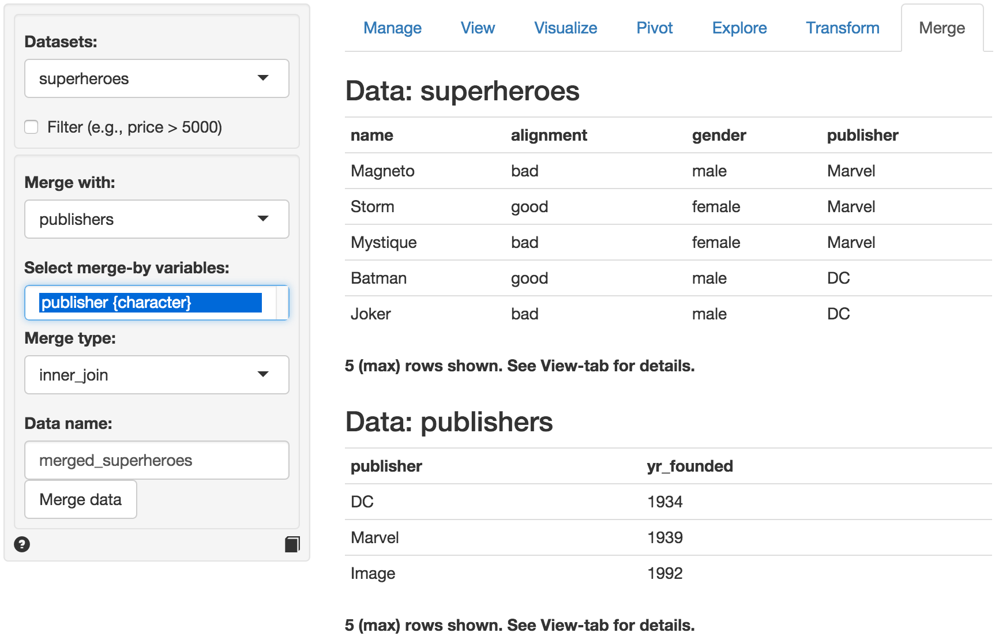

> Merge (join) two datasets

There are four merge options available in Radiant from the [dplyr](http://www.rdocumentation.org/packages/dplyr) package developed by Hadley Wickham and Romain Francois on [GitHub](https://github.com/hadley/dplyr).

We will use two small datasets, `superheroes` and `publishers`, created by Jenny Bryan to illustrate the different merge / join types (see source information below).

```{r echo = FALSE}
suppressPackageStartupMessages(library(radiant))
knitr::kable(superheroes, align = 'l', caption = "Superheroes")
knitr::kable(publishers, align = 'l', caption = "Publishers")
```

In the screen-shot of the Data > Merge tab below we see the two datasets. The tables share variable `publisher` that is automatically select for the merge / join. There are different ways to merge / join the data that we will discuss below.



<br>


### Inner join (superheroes, publishers)

> An inner join return all rows from x with matching values in y, and all columns from both x and y. If there are multiple matches between x and y, all match combinations are returned.

```{r echo = FALSE}
inner_join(superheroes, publishers, by = "publisher") %>% knitr::kable(., align = 'l')
```

In the table above we lose _Hellboy_ because, although this hero does appear in `superheroes`, the publisher (_Dark Horse Comics_) does not appear in `publishers`. The join result has all variables from `superheroes`, plus _yr\_founded_, from `publishers`. We can visualize an inner join with the venn-diagram below:


Notice that a join can change the row and variable order so you should not rely on these in an analysis. The command that Radiant uses internally is:

```r
mergedata(dataset = "superheroes", dataset2 = "publishers", merge_vars = "publisher", merge_type = "left_join", merge_name = "merged_superheroes")
```

The same result can be achieved with the following R-code:

```r
merged_superheroes <- inner_join(superheroes, publishers, by = "publisher")
```

<br>

### Semi join (superheroes, publishers)

> A semi join keeps only columns from x. Whereas an inner join will return one row of x for each matching row of y, a semi join will never duplicate rows of x.

```{r echo = FALSE}
semi_join(superheroes, publishers, by = "publisher") %>% knitr::kable(., align = 'l')
```

We get a similar table as with `inner_join` but it contains only the variables in `superheroes`. The command that Radiant uses internally is:

```r
mergedata(dataset = "superheroes", dataset2 = "publishers", merge_vars = "publisher", merge_type = "semi_join", merge_name = "merged_superheroes")
```

The same result can be achieved with the following R-code:

```r
merged_superheroes <- semi_join(superheroes, publishers, by = "publisher")
```

<br>

### Left join (superheroes, publishers)

> A left join returns all rows from x, and all columns from x and y. If there are multiple matches between x and y, all match combinations are returned.

 ```{r echo = FALSE}
left_join(superheroes, publishers, by = "publisher") %>% knitr::kable(., align = 'l')
```

We result table contains `superheroes` with variable `yr_founded` from `publishers`. _Hellboy_, whose publisher does not appear in `publishers`, has an `NA` for _yr_founded_. We can visualize a left join with the venn-diagram below:


The command that Radiant uses internally is:

```r
mergedata(dataset = "superheroes", dataset2 = "publishers", merge_vars = "publisher", merge_type = "semi_join", merge_name = "merged_superheroes")
```

The same result can be achieved with the following R-code:

```r
merged_superheroes <- semi_join(superheroes, publishers, by = "publisher")
```

<br>

### Anti join (superheroes, publishers)

> An anti join returns all rows from x without matching values in y, keeping only columns from x

```{r echo = FALSE}
anti_join(superheroes, publishers, by = "publisher") %>% knitr::kable(., align = 'l')
```

We now get **only** _Hellboy_ and we do not get the variable _yr\_founded_. We can visualize an anti join with the venn-diagram below:


<br>

### Dataset order

Note that the order of the datasets matters for semi, left, and anti join. If we setup the Data > Merge tab as below the results are as follow:


<br>

### Inner join (publishers, superheroes)

```{r echo = FALSE}
inner_join(publishers, superheroes, by = "publisher") %>% knitr::kable(., align = 'l')
```

Every publisher that has a match in `superheroes` appears multiple times, once for each match. Apart from variable order, this is the same result we had above.

<br>

### Semi join (publishers, superheroes)

```{r echo = FALSE}
semi_join(publishers, superheroes, by = "publisher") %>% knitr::kable(., align = 'l')
```

With semi join the effect of switching the dataset order is more clear. Even though there are multiple matches for each publisher only one is shown. Publisher _Image_ is lost, because it is not in `superheroes`.

<br>

### Left join (publishers, superheroes)

```{r echo = FALSE}
left_join(publishers, superheroes, by = "publisher") %>% knitr::kable(., align = 'l')
```

As before, we get first dataset back (here `publishers`) but not with added variables from `superheroes` dataset. Note that, in contrast to the inner join, publisher _Image_ survives, even though no superheroes from _Image_ appear in `superheroes`. As a result, _Image_ has NAs for variables _name_, _alignment_, and _gender_.

<br>

### Anti join (publishers, superheroes)

```{r echo = FALSE}
anti_join(publishers, superheroes, by = "publisher") %>% knitr::kable(., align = 'l')
```

Only publisher _Image_ is retained now and all variables in `publishers`.

<br>

### Outer join (publishers, superheroes)

An outer join combines two data.frames, keeping rows and columns that appear in either. Note that this join is not currently available in _dplyr_.

```{r echo = FALSE}
outer_join(publishers, superheroes, by = "publisher") %>% knitr::kable(., align = 'l')
```

In this table we keep _Hellboy_ (even though _Dark Horse Comics_ is not in `publishers`) and _Image_ (even though the publisher is not listed in `superheroes`) and get variables from both datasets. Observations without a match are assigned the value NA for variables from the _other_ dataset. We can visualize an outer join with the venn-diagram below:


The command that Radiant uses internally is:

```r
mergedata(dataset = "publishers", dataset2 = "superheroes", merge_vars = "publisher", merge_type = "outer_join", merge_name = "merged_superheroes")
```

The same result can be achieved with the following R-code:

```r
merged_superheroes <- merge(superheroes, publishers, by = "publisher", all = TRUE)
```

or if you have the Radiant library loaded with:

```r
merged_superheroes <- outer_join(superheroes, publishers, by = "publisher")
```

---------------
Based on [Cheatsheet for dplyr join functions](http://stat545-ubc.github.io/bit001_dplyr-cheatsheet.html) by Jenny Bryan
