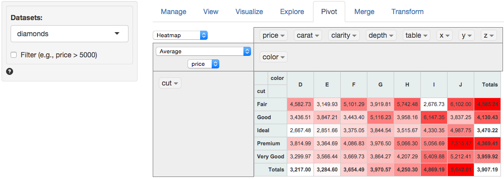

> Summarize, explore, and pivot your data

If you have used pivot-tables in Excel the functionality provided in the Pivot tab should be familiar to you. Similar to the Explore tab, you can generate summary statistics for one or more variables in your data. You can also easily generate frequency tables. Again, the most powerful feature in Pivot is that you can easy describe the data _by_ one or more other variables.

For example, with the `diamonds` data loaded drag-and-drop `cut` to the column on the left. Next drag-and-drop `color` one row down. This will create a frequency table of diamonds with different levels of cut and color. Choose `Heatmap` rather than `Table` to emphasize the highest frequency counts (for fun also try `Treemap`). Now select `Average` rather than `Count` and choose `Price` from the new dropdown shown. This will produce the graphic below.

#### Filter

Use the `Filter` box to select (or omit) specific sets of rows from the data. See the helpfile for Data > View for details.

#### Source

The functionality in the pivot tab was developed by [Nicolas Kructen](http://nicolas.kruchten.com/pivottable/examples/). The binding that allows R to communicate with the javascript library was written by [Enzo Martoglio](https://github.com/smartinsightsfromdata).
