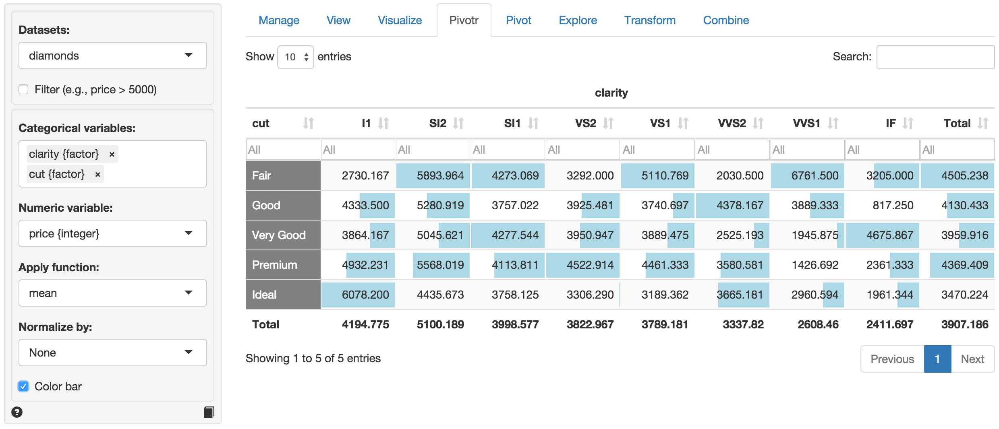

> Create pivot tables to explore your data

If you have used pivot-tables in Excel the functionality provided in the Pivot tab should be familiar to you. Similar to the Explore tab, you can generate summary statistics for variables in your data. You can also easily generate frequency tables. Perhaps the most powerful feature in Pivot is that you can easy describe the data _by_ one or more other variables.

For example, with the `diamonds` data select `clarity` and `cut` from the Categorical variables drop-down. You can drag-and-drop the selected variables to change their order. The categories for first variable will be the column headers. After selecting these two variables a frequency table of diamonds with different levels of clarity and quality of cut. Choose `Row`, `Column`, or `Total` from the Normalize drop-down to normalize the frequencies by row, column, or overall total. If a normalize option is selected it can be convenient to check the `Percentage` box to express the numbers as percentages. Choose `Color bar` or `Heat map` from the Conditional formatting drop-down to emphasize the highest frequency counts.

It is also possible to summarize numerical variables. Select `price` from the Numerical variables drop-down. This will create the table shown below. Just as in the View tab you can sort the table by clicking on the column headers. You can also use sliders (e.g., click in the input box below `I1`) to limit the view to values in a specified range. To view only information for diamonds with `Fair` or `Good` cut quality click in the input box below the `cut` header.

### Filter

Use the `Filter` box to select (or omit) specific sets of rows from the data. See the help file for Data > View for details.
