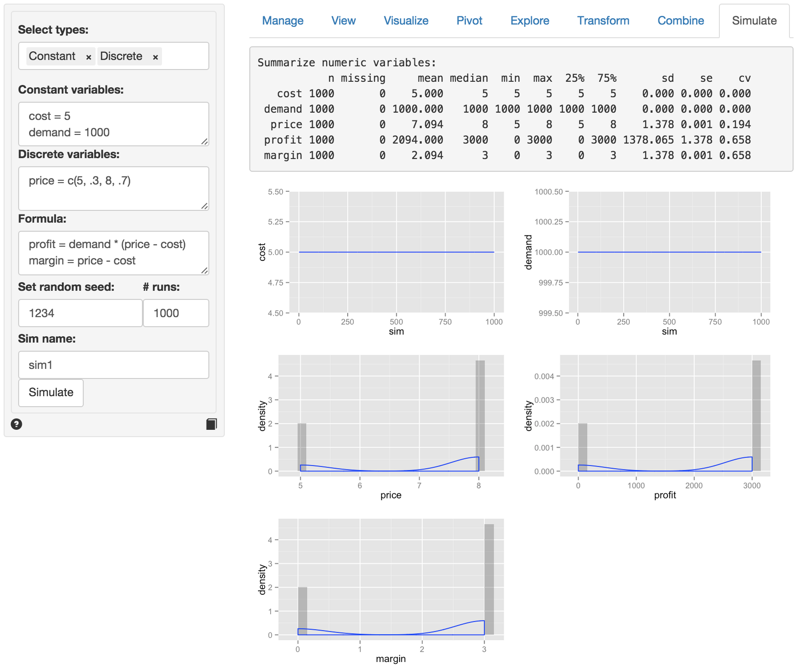
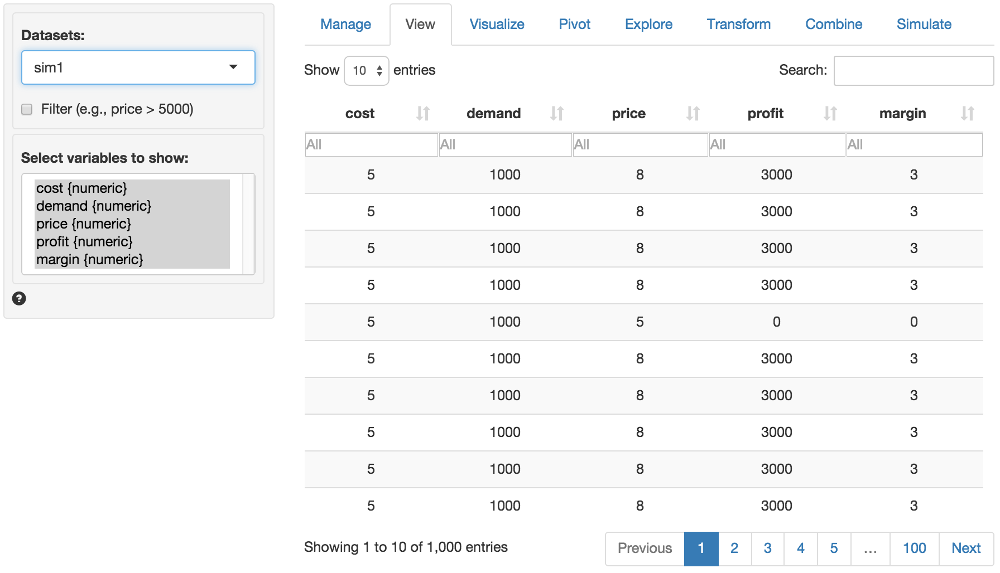

> Simulate data for decision analysis

Select the types of variables to use in the analysis from the `Select types` dropdown.

If selected, list the constants to include in the analysis in the `Constant variables` text area (e.g., "cost = 3"). If there are multiple variables to include simply press `return` on your keyboard and write out the information for the next variable.

If selected, list the uniformly distributed random variables to include in the analysis in the `Uniform variables` text area (e.g., "demand = c(1000,2000)"). Note that the first number is the **minimum** and the second is the **maximum** value.

As for constant variables, if there are multiple uniformly distributed variables to include simply press `return` and write out the information for the next variable.

If selected, list the normally distributed random variables in the `Normal variables` text area (e.g., "demand = c(2000,1000)"). Note that the first number is the **mean** and the second the **standard deviation**.

If selected, list the random variables with a discrete distribution in the `Discrete variables` text area (e.g., "price = c(5, .3, 8, .7)" where **for each pair of numbers the first is the value and the second the probability**). Note that the probabilities should sum to 1.

To perform a calculation using the variables specified in the various text input boxes create a formula in the `Formula` input box (e.g., "profit = demand * (price - cost)"). Note that you can enter multiple formulas. If, for example, you would also like to calculate the margin for each simulation press `return` after the first formula and enter "margin = price - cost".

The value shown in the `# runs` input determines the number of simulation runs that will be used. If you need to repeat an analysis with the same randomly generate values enter a number into `Random seed` input.

To save the simulated data for further analysis in Radiant specify a name in the `Sim name` input box. You can investigate the simulated data by choosing the specified name from the `Datasets` dropdown in any of the other Data tabs.

When all desired inputs have been specified press the `Simulate` button to generate the desired output.

In the screen shot shown below cost and demand are specified as constants. Price is a discrete random variable. With 30% probability it is set to $5 and it is set to $8 with 70% probability. There are two formulas, one for profit and one for margin.

Because we specified a name in the `Sim name` box the data is available as `sim1` within Radiant (see screen shot below). To use the data in Excel go to the Manage tab and either save the data to a csv file or use the clipboard feature. For more information see the help file for the Manage tab.

