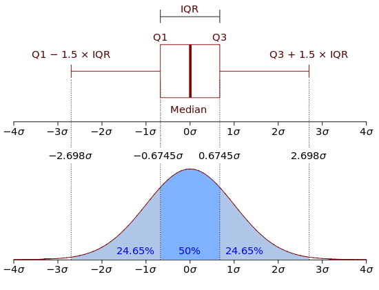

**Visualize data**

#### Number of plots

Start by experimenting with different selections for the X-variable for a single plot (click the Single radio button). This will produce a simple histogram for the X-variable. Then try adding a Y-variable to create a scatter plot (or a box-plot if one of the variables is categorical). Facet row and Facet column can be used to split the data into different parts and then create a separate plot for each subset of the data (either a histogram or a scatter/box plot depending on whether a Y-variable has been selected).

If you have both and X and a Y-variable selected you will see a drop-down Color. Here you can select a variable to create a type of heat-map where the colors are linked to the value of the select Color variable.

Select the Multiple radio button to quickly create multiple plots. For example, with Diamonds data loaded, choose None for the Y-variable and all variables as X-variables (use CTRL-A or CMD-A). This will create histograms for all variables in your data set.

To create multiple scatter/box plots select the Multiple radio button and then, with Diamonds data loaded, choose price as the Y-variable and all others as X-variables. This will produce a set of scatter and box plots. You can select a Color variable but Facet row and Facet column are not available when the Multiple radio-button has been selected.

#### Line, Loess, and Jitter

To add a linear or non-linear regression line to a scatter plot check the Line and/or Loess boxes. If your data take on a limited number of values, checking Jitter can be useful to get a better feel for where most of the data points are located. Jitter simply adds a small random value to each data point so they do not overlap completely in the plot(s).

#### Box plots

The upper and lower "hinges" of the box correspond to the first and third quartiles (the 25th and 75th percentiles) in the data. The middle hinge is the median value of the data. The upper whisker extends from the upper hinge (i.e., the top of the box) to the highest value in the data that is within 1.5 x IQR of the upper hinge. IQR is the inter-quartile range, or distance, between the first and third quartiles. The lower whisker extends from the lower hinge to the lowest value in the data within 1.5 x IQR of the lower hinge. Data beyond the end of the whiskers could be outliers and are plotted as points (as suggested by Tukey).

In sum:   
1. The upper whisker extends from Q3 to min(max(data), Q3+1.5*IQR)  
2. The lower whisker extends from Q1 to max(min(data), Q1-1.5*IQR)

You may have to read the two bullets a few times before it sinks in. The plot below should help to explain the structure of the box plot.

[Source](http://en.wikipedia.org/wiki/File:Boxplot_vs_PDF.svg)

#### Subset

Use Subset to select (or omit) specific sets of rows from the data. You can use > and < signs and even combine filter commands. For example, x > 3 & y == 2 would select only those rows for which the variable x has values larger than 3 __and__ for which y has values equal to 2. Type your filter statement in the Subset box and press enter to see the result on screen. 

#### Plot height and Width

To make plots bigger or smaller adjust the values in the height and width boxes on the bottom left.

&copy; Vincent Nijs (2014) 
