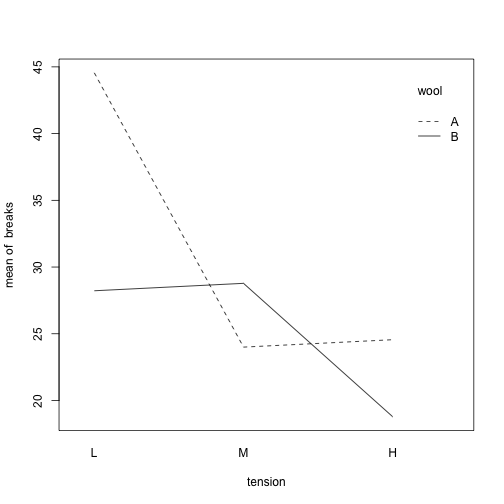

> Anova


### Data


```r
head(warpbreaks)
```

```
##   breaks wool tension
## 1     26    A       L
## 2     30    A       L
## 3     54    A       L
## 4     25    A       L
## 5     70    A       L
## 6     52    A       L
```

Two easy ways to run anova:


```r
tens.aov <- aov(breaks ~ tension, data = warpbreaks)
print(tens.aov)
```

```
## Call:
##    aov(formula = breaks ~ tension, data = warpbreaks)
## 
## Terms:
##                  tension Residuals
## Sum of Squares  2034.259  7198.556
## Deg. of Freedom        2        51
## 
## Residual standard error: 11.88058
## Estimated effects may be unbalanced
```

```r
summary(tens.aov)
```

```
##             Df Sum Sq Mean Sq F value  Pr(>F)   
## tension      2   2034  1017.1   7.206 0.00175 **
## Residuals   51   7199   141.1                   
## ---
## Signif. codes:  0 '***' 0.001 '**' 0.01 '*' 0.05 '.' 0.1 ' ' 1
```

Or,


```r
tens.lm <- lm(breaks ~ tension, data = warpbreaks)
anova (tens.lm)
```

```
## Analysis of Variance Table
## 
## Response: breaks
##           Df Sum Sq Mean Sq F value   Pr(>F)   
## tension    2 2034.3 1017.13  7.2061 0.001753 **
## Residuals 51 7198.6  141.15                    
## ---
## Signif. codes:  0 '***' 0.001 '**' 0.01 '*' 0.05 '.' 0.1 ' ' 1
```

Like with regular LM it’s easy to test for interactions between factors:


```r
summary(aov(breaks~wool*tension, warpbreaks))
```

```
##              Df Sum Sq Mean Sq F value   Pr(>F)    
## wool          1    451   450.7   3.765 0.058213 .  
## tension       2   2034  1017.1   8.498 0.000693 ***
## wool:tension  2   1003   501.4   4.189 0.021044 *  
## Residuals    48   5745   119.7                     
## ---
## Signif. codes:  0 '***' 0.001 '**' 0.01 '*' 0.05 '.' 0.1 ' ' 1
```

The easiest way to visualize an interaction like this is with an ugly but functional interaction plot:


```r
with(warpbreaks,interaction.plot(tension,wool,breaks))
```



(it takes 3 arguments: the first is the factor for the x-axis, then the trace factor for the different lines, then the response variable). And then of course you could instead use a barplot (using something like ggplot to make it prettier).

With ANOVAs, you also have the option of ANCOVA – using a covariate to soak up variance, or testing whether there’s an effect of variable X1 above and beyond that of variable X2, much like you’d include a control var/fixed effect in regression, so the R code is really similar. If you were using tension as a covariate (doesn’t make sense for this dataset, but just for example’s sake):


```r
summary(aov(breaks ~ tension + wool, warpbreaks))
```

```
##             Df Sum Sq Mean Sq F value  Pr(>F)   
## tension      2   2034  1017.1   7.537 0.00138 **
## wool         1    451   450.7   3.339 0.07361 . 
## Residuals   50   6748   135.0                   
## ---
## Signif. codes:  0 '***' 0.001 '**' 0.01 '*' 0.05 '.' 0.1 ' ' 1
```

The trick is that the covariate always has to be listed first in the code, because apparently R reads in AOV items stepwise.

Then the only other 2 major features would be linear contrasts, and repeated measures analyses… unfortunately I don’t remember much about these topics and don’t have accessible code on them  :-/ but Yidan and Min are both very good at stats and R, and they might be able to help!

Oh and another (simpler) way to test for where the true differences are between groups (if you find a significant effect of the factor overall) is to use a Tukey HSD test:


```r
TukeyHSD(tens.aov)
```

```
##   Tukey multiple comparisons of means
##     95% family-wise confidence level
## 
## Fit: aov(formula = breaks ~ tension, data = warpbreaks)
## 
## $tension
##           diff       lwr        upr     p adj
## M-L -10.000000 -19.55982 -0.4401756 0.0384598
## H-L -14.722222 -24.28205 -5.1623978 0.0014315
## H-M  -4.722222 -14.28205  4.8376022 0.4630831
```

This will output all pairwise comparisons between the groups in your factor.

